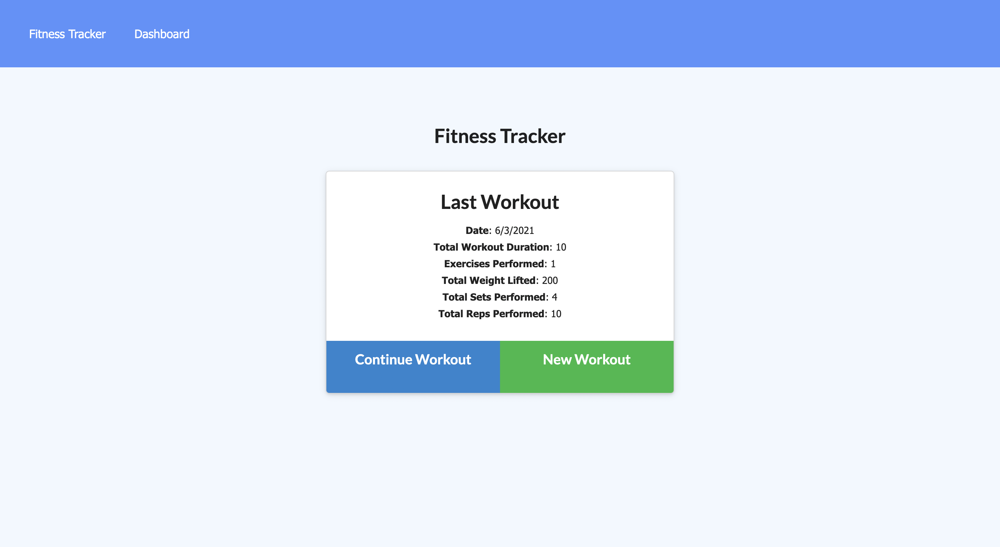
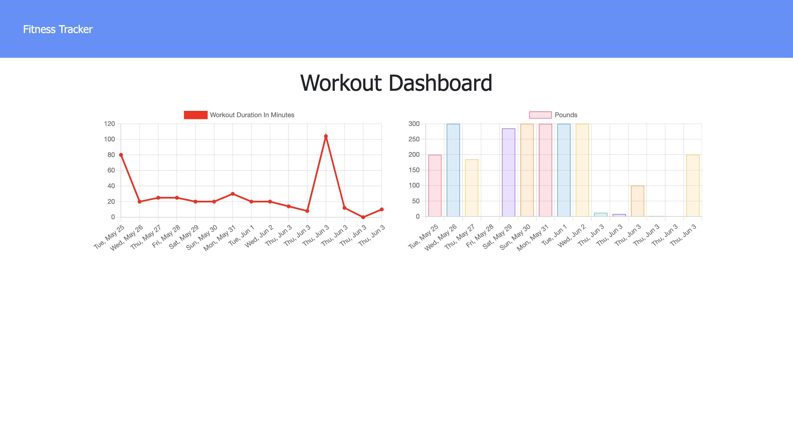

# Fitness Tracker

## Table of Contents
[Project Link](#Link)  
[Technologies](#Technologies)  
[Description](#Description)  
[Screenshots](#Screenshots)  
[License](#License)  
[Contact](#Contact)

## Link
https://immense-falls-27616.herokuapp.com/

## Technologies
Javascript, express.js, mongoose, morgan, nodemon

## Description
A webpage that allows the user to keep track of the workouts they have completed over the previous seven days. Users may add a new workout, add new exercises to an existing workout, and view a panel that graphically displays total duration and total weight for workouts of the previous seven days.

## Screenshots

## License
MIT

## Contact
Dalton Wilkins - daltongh@gmail.com
